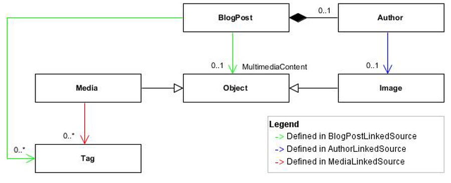

Slightly More Complex Example
---------------
To execute this example, see [LinkIt.Samples](LinkIt.Samples/SlightlyMoreComplexExample.cs). 

Let's say you have a blog post class that references media, images and tags by IDs. 

  

```csharp
public class BlogPost {
    public int Id { get; set; }
    public string Title { get; set; }
    public List<int> TagIds { get; set; }
    public Author Author { get; set; }
    public MultimediaContentReference MultimediaContentRef { get; set; }
}

public class Author {
    public string Name { get; set; }
    public string Email { get; set; }
    public string ImageId { get; set; }
}

public class MultimediaContentReference {
    public string Type { get; set; }
    public object Id { get; set; }
}

public class Image {
    public string Id { get; set; }
    public string Credits { get; set; }
    public string Url { get; set; }
}
```
The model and linked source for media and tags are defined in the [getting started example](README.md).

The linked source representing a blog post with its media, images and tags would be defined like this:
```csharp
public class BlogPostLinkedSource : ILinkedSource<BlogPost> {
    public BlogPost Model { get; set; }
    public List<Tag> Tags { get; set; }
    public AuthorLinkedSource Author { get; set; }
    public object MultimediaContent { get; set; }
}

public class AuthorLinkedSource : ILinkedSource<Author> {
    public Author Model { get; set; }
    public Image Image { get; set; }
}
```

### LoadLinkProtocol
Most of the load link protocol can be defined using the default conventions. 
- `BlogPostLinkedSource/Tags` will match `BlogPost/TagIds`
- `BlogPostLinkedSource/Author` will match `BlogPost/Author`
- `AuthorLinkedSource/Image` will match `Author/ImageId`

The `BlogPost` object owns a nested object of type `Author`. In order to load link the author with its own linked image, we need to add the link target `BlogPostLinkedSource/Author` as a nested linked source of type `AuthorLinkedSource`.

### Polymorphism
For the linked target `BlogPostLinkedSource/MultimediaContent`, we need to configure the load link protocol since none of the default conventions applies. Moreover, it is a special configuration since it involves some polymorphism.
```csharp
public class BlogPostLinkedSourceConfig : ILoadLinkProtocolConfig {
    public void ConfigureLoadLinkProtocol(LoadLinkProtocolBuilder loadLinkProtocolBuilder) {
        loadLinkProtocolBuilder.For<BlogPostLinkedSource>()
            .PolymorphicLoadLink(
                linkedSource => linkedSource.Model.MultimediaContentRef,
                linkedSource => linkedSource.MultimediaContent,
                link => link.Type,
                includes => includes
                    .Include<MediaLinkedSource>().AsNestedLinkedSourceById(
                        "media",
                        link => (int)link.Id
                    )
                    .Include<Image>().AsReferenceById(
                        "image",
                        link => (string)link.Id
                    )
            );
    }
}
```

If `MultimediaContentRef.Type` is `"image"`, then an image will be loaded and linked; however, if `MultimediaContentRef.Type` is `"media"`, a media along with its tags will be loaded and linked. Here, we are reusing `MediaLinkedSource` as defined in the [Getting Started](README.md) example.

### Usage
Load link by ID
```csharp
var actual = loadLinkProtocol.LoadLink<BlogPostLinkedSource>().ById(1);
```

Load link by IDs
```csharp
var actual = _loadLinkProtocol.LoadLink<BlogPostLinkedSource>().ByIds(
    new List<int>{3,2,1}
);
```

Load link query
```csharp
var models = GetBlogPostByKeyword("fish");
var actual = _loadLinkProtocol.LoadLink<BlogPostLinkedSource>().FromModels(models);
```

Load link transient model (not in a data source)
```csharp
var model = new BlogPost {
    Id = 101,
    Author = new Author{
        Name = "author-name-101",
        Email = "author-email-101",
        ImageId = "distinc-id-loaded-once", //same entity referenced twice
    },
    MultimediaContentRef = new MultimediaContentReference{
        Type = "image",
        Id = "distinc-id-loaded-once" //same entity referenced twice
    },
    TagIds = new List<int>{
        1001,
        1002
    },
    Title = "Title-101"
};

var actual = _loadLinkProtocol.LoadLink<BlogPostLinkedSource>().FromModel(model);
```

### Read more
- [Why Should I Use LinkIt?](why-without-how.md)
- [Getting Started](getting-started.md)
- [Known Limitations](known-limitations.md)
- [License](LICENSE.txt)

### See also
- Perform complex projections easily with [LinkIt AutoMapper Extensions](https://github.com/cbcrc/LinkIt.AutoMapperExtensions)
