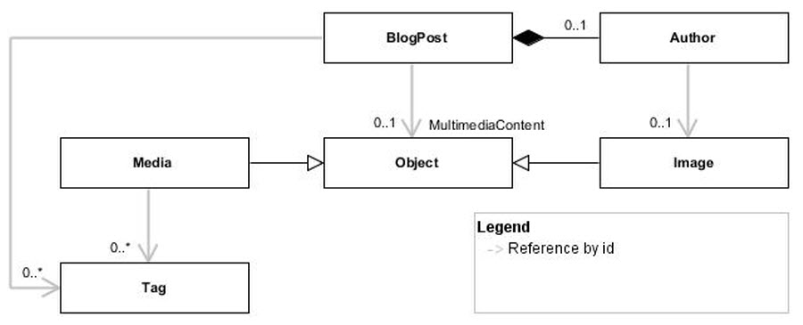

Why Should I Use LinkIt?
===============
Before getting started with how to use LinkIt, you may wonder why you should use it. The main features of LinkIt are going to be demonstrated in the following example. This should help you to determine if LinkIt is a good fit for you.

The Example
---------------
 

For example, here's an instance of each object type.

**BlogPost**
```json
{
	"id": 1,
	"title": "Title-1",
	"tagIds": [
		89,
		90
	],
	"author": {
		"name": "author-name-1",
		"email": "author-email-1",
		"imageId": "id-501"
	},
	"multimediaContentRef": {
		"type": "media",
		"id": 1
	}
}
```

**Media**
```json
{
  "id": 1,
  "title": "title-1",
  "tagIds": [
    1001,
    1002
  ]
}
```

**Image**
```json
{
	"id": "id-501",
	"credits": "id-501-credits",
	"url": "id-501-url"
}
```

**Tag**
```json
{
  "id": 89,
  "name": "89-name"
}
```

The Features
---------------
### Built-in support for references between complex types
The types `BlogPost` and `Media` are complex types since they contain nested types. A `BlogPost` contains three nested types: a list of integers (`TagIds`), `Author` and `MultimediaContentReference`. A `Media` contains a list of integers (`TagIds`).

As described by the [object-relational impedance mismatch](https://en.wikipedia.org/wiki/Object-relational_impedance_mismatch) problem, it is typically difficult to handle references between complex types in relationnal databases. 

On to other hand, document database typically favor the scenario where references can be denormalized, but don't always provide effective tooling for refreshing those denormalized references. Moreover, the scenario where references cannot be easily denormalized is not always fully supported.

LinkIt offer built-in support for references between complex types.

### Data source independant
For the sake of example, let `BlogPost` be stored in a document database, `Media` and `Tag` be stored in a relationnal database and the `Image` be exposed through a web service. LinkIt is data source independant. This means that it's possible to load objects that are stored in different data sources and link them together. 

Moreover, the query languages of document database are not standardized like SQL was for relationnal databases. LinkIt offer a limited query language that can be used accross any data sources.

### Minimize coding effort by leveraging reuse and composition
Imagine we need to fulfill theses three queries:

1. Get a specific media with its tags
2. Get a specific blog post with its tags, images, media (and media's tags)
3. Get a list of blog posts with its tags, images, media (and media's tags)

The load link protocol used to fulfill query 1. can be reused to fulfill query 2. Moreover, query 3. can be fulfilled by reusing query 2 and query 1. 

LinkIt was designed to promote composition and reuse. This has a big impact on increasing code quality and minimizing coding effort. It allows for defining small queries that are ready to be reused in other contexts. Write once, test once, reuse everywhere! 

### Avoid the Select N + 1 problem
LinkIt guarantee that all the lookup ids for the same reference type will always be loaded in one batch regardless of the complexity of the linked sources. 

In order to avoid the [select N + 1 problem](http://stackoverflow.com/questions/97197/what-is-the-n1-selects-issue) in the third query of the above example, the tag ids of each blog post and of each media of each blog post will be loaded in one single batch.

### Support polymorphism out of the box
A polymorphic reference is a reference toward an object that can be of many different types. For example, `BlogPost` has a property named `MultimediaContent` that reference either a `Media` or an `Image`. Polymorphic references are typically difficult to handle, but LinkIt support them out of the box.

### Favor convention over configuration
LinkIt uses a declarative syntaxe in order to define how different types of object must be loaded and linked together. Working with LinkIt is closer to working with configuration files than writing imperative code. 

However, if the default naming conventions proposed by LinkIt are respected, most of the configurations can be avoided. Moreover, LinkIt allows you to define you own naming conventions. 

### Perform complex projections easily with LinkIt AutoMapper Extensions
When using LinkIt you often need to map the object created for LinkIt to a DTO. 

In the .Net community, [AutoMapper](http://automapper.org/) is a well established solution for mapping one object to another. Thus, LinkIt does not try to reinvente the wheel but instead provide some [extensions](https://github.com/cbcrc/LinkIt.AutoMapperExtensions) for AutoMapper in order to map the objects created for LinkIt to any other objects seamlessly.

### Read more
- [Why Should I Use LinkIt?](why-without-how.md)
- [Getting Started](getting-started.md)
- [Slightly More Complex Example](slightly-more-complex-example.md)
- [Known Limitations](known-limitations.md)
- [License](LICENSE.txt)
